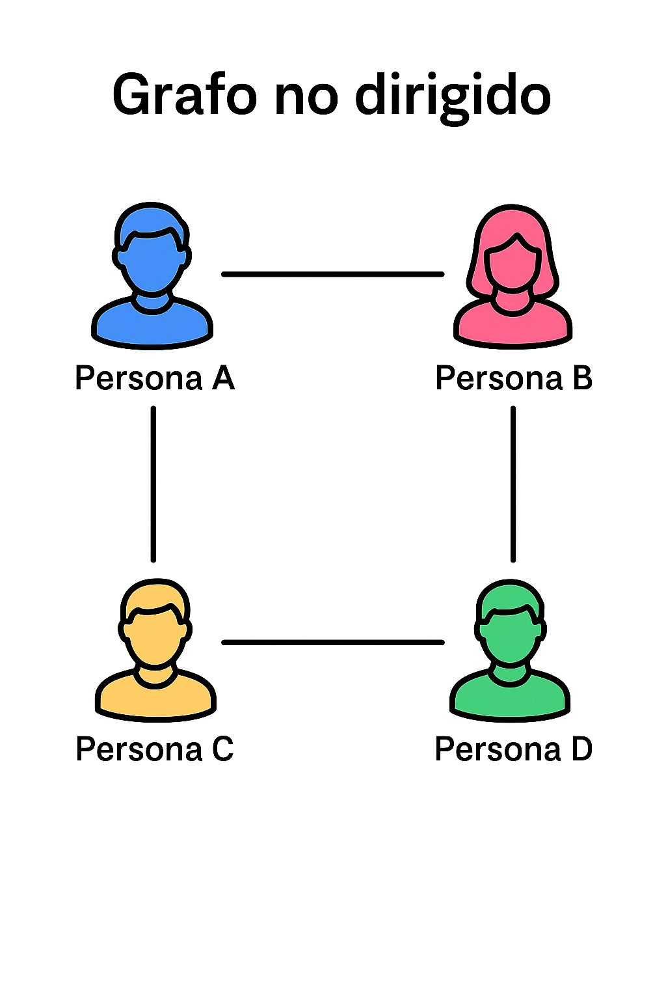
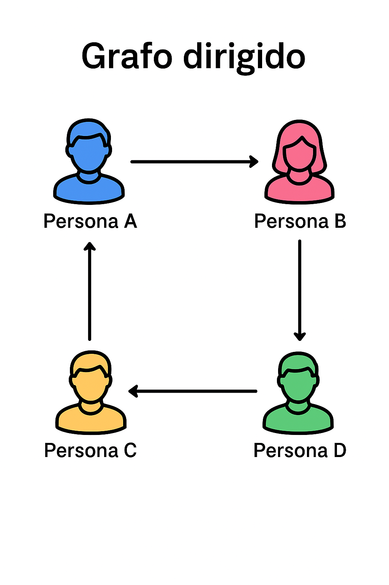
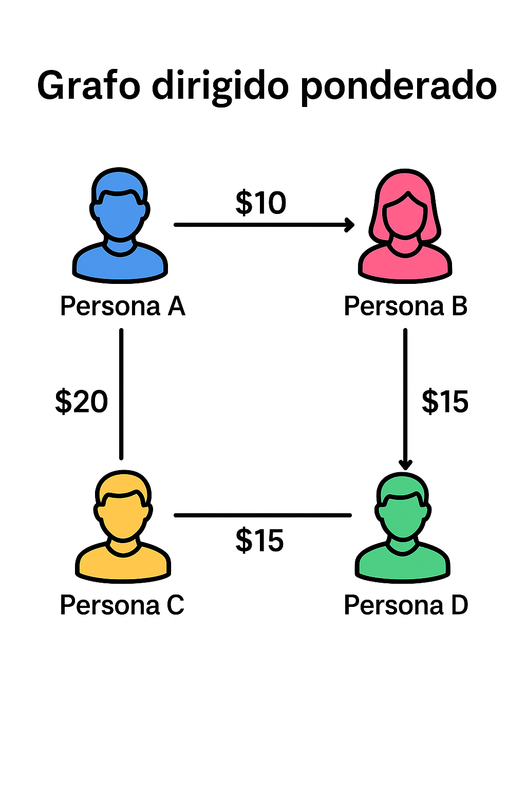
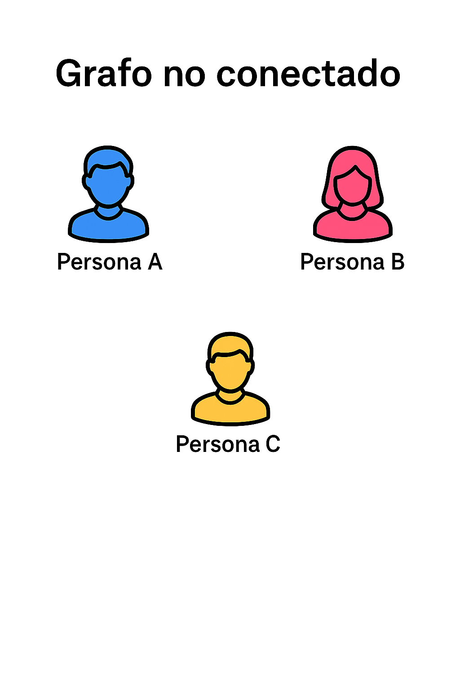
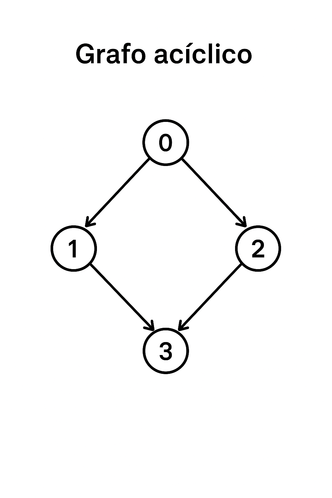

## 📚 ¿Qué es un Grafo?

Un **grafo** es, en esencia, un mapa de conexiones. Es una forma de representar cómo diferentes cosas (entidades) se relacionan entre sí.  Piensa en él como un conjunto de puntos, llamados **vértices** (o **nodos**), y líneas que los unen, llamadas **aristas** (o **conexiones**).

Su propósito principal es modelar redes complejas. Por ejemplo, en un mapa, las ciudades son los *vértices* y las carreteras son las *aristas*. En una red social, las personas son los *vértices* y las "amistades" son las *aristas*.

A diferencia de estructuras de datos más simples como las listas (donde un elemento sigue a otro en orden), los grafos son no lineales. Esto los hace increíblemente versátiles para resolver problemas del mundo real, como encontrar la ruta más corta en un GPS, detectar círculos de amigos en una red social o entender las dependencias en un proyecto.

### Conceptos Básicos

Para entender los grafos, necesitas conocer su vocabulario. Los **vértices** (o nodos) son las entidades individuales, como 'Ciudad A', 'Persona X' o 'Tarea 1'. Las **aristas** (o ejes) son las que definen la relación entre esos vértices, como la carretera de 'Ciudad A' a 'Ciudad B'.

El **grado de un vértice** es simplemente el número de aristas que se conectan a él; en una red social, sería tu número de amigos. Un **camino** es una secuencia de vértices que puedes seguir a través de las aristas, como un viaje en coche de ciudad en ciudad. Un **ciclo** es un camino especial que te permite salir de un vértice y, tras seguir varias conexiones, regresar al mismo punto de partida.

Para guardar un grafo en la memoria de una computadora, se usan dos métodos principales. La **Matriz de Adyacencia** es una tabla gigante (como una hoja de cálculo) donde cada fila y columna representa un vértice. Pones un '1' si están conectados y un '0' si no lo están. Es muy rápida para verificar una conexión, pero gasta mucha memoria si hay pocos caminos (un grafo "disperso"). La **Lista de Adyacencia** es más eficiente para esos casos: cada vértice simplemente mantiene una lista de sus vecinos directos.

### Algoritmos Esenciales

Una vez que tienes el grafo, puedes hacerle preguntas usando algoritmos. Los más comunes son para recorrerlo. **BFS (Búsqueda en Anchura)** explora el grafo "capa por capa", como las ondas que se expanden en un estanque. Es perfecto para encontrar el camino más corto entre dos nodos (si las aristas no tienen "costo" o peso). **DFS (Búsqueda en Profundidad)** explora "yendo a fondo": toma un camino y lo sigue hasta el final antes de retroceder y probar otro. Es excelente para detectar si existen ciclos o para ver qué partes del grafo están conectadas.

Ambos algoritmos tienen una eficiencia de **O(V + E)**. Esta notación (llamada "Big O") solo significa que el tiempo que tardan en ejecutarse es proporcional a la suma de todos los vértices (V) y todas las aristas (E). En resumen: son muy eficientes.

Para grafos más complejos, como un GPS donde las carreteras tienen distancias, usamos algoritmos como **Dijkstra**, que encuentra el camino más corto en grafos con "pesos" (costos) positivos. Si quieres encontrar la forma más barata de conectar *todos* los puntos (como tender el mínimo cableado para conectar varias casas), usas **Kruskal** o **Prim** para encontrar el **Árbol de Expansión Mínima** (MST).

### Tipos principales que exploraremos:

A continuación, exploraremos los tipos principales: Grafos No Dirigidos, Grafos Dirigidos, Grafos Ponderados, Grafos Conectados y Grafos Acíclicos (DAGs).

-----

# 1\. Grafos No Dirigidos



### Definición Técnica

Este es el tipo más simple. Es un grafo donde las aristas son bidireccionales, como una calle de doble sentido. Si el vértice A está conectado al vértice B, entonces B también está conectado a A automáticamente. La relación es mutua.

### Representación Visual en Memoria (Usando Lista de Adyacencia)

Imagina 4 vértices (0, 1, 2, 3). La lista de adyacencia nos dice quién está conectado con quién:

```ascii
Vértices: 0, 1, 2, 3

Lista de Adyacencia:
0 → 1, 2  (0 está conectado a 1 y 2)
1 → 0, 3  (1 está conectado a 0 y 3)
2 → 0, 3  (2 está conectado a 0 y 3)
3 → 1, 2  (3 está conectado a 1 y 2)

Dibujo ASCII (Forma de diamante):
       (0)
      /   \
     /     \
    (1)     (2)
     \     /
      \   /
       (3)
```

### 🔧 Características Clave

La característica principal es la **simetría**. Son perfectos para modelar relaciones mutuas, como "ser amigo de" en Facebook o carreteras de doble sentido. Verificar si dos nodos están conectados es muy rápido. En una lista de adyacencia, agregar o quitar una amistad (arista) también es muy eficiente, aunque debes hacerlo en las listas de *ambos* vértices. Su desventaja es que no pueden modelar relaciones donde la dirección importa, como "A sigue a B" en Twitter (donde B podría no seguir a A).

-----

# ➡️ 2. Grafos Dirigidos (Dígrafos)



### 🔹 Definición Técnica

Aquí, las aristas tienen dirección, como una calle de sentido único. Se representan con flechas. Una arista que va de A hacia B *no* implica que exista una arista de B hacia A.

### 🧩 Representación Visual en Memoria (Usando Lista de Adyacencia)

```ascii
Vértices: 0, 1, 2, 3

Lista de Adyacencia:
0 → 1, 2  (De 0 puedes ir a 1 y 2)
1 → 3     (De 1 solo puedes ir a 3)
2 → 3     (De 2 solo puedes ir a 3)
3 →       (De 3 no puedes ir a ningún lado)

Dibujo ASCII (Con flechas claras):
       (0)
      /   \
     /     \
    v       v
   (1)     (2)
    \       /
     \     /
      v   v
       (3)
```

### 🔧 Características Clave

La **direccionalidad** es clave. Permiten modelar relaciones asimétricas. Piensa en enlaces web (puedes enlazar a Google, pero Google no te enlaza a ti) o flujos de trabajo (la 'Tarea A' debe completarse *antes* que la 'Tarea B').  Esto introduce nuevos conceptos: un vértice tiene un **grado de salida** (cuántas flechas *salen* de él) y un **grado de entrada** (cuántas flechas *llegan* a él). Son fundamentales para algoritmos que ordenan tareas, conocidos como "ordenamiento topológico".

-----

# ⚖️ 3. Grafos Ponderados



### 🔹 Definición Técnica

Es un grafo (que puede ser dirigido o no dirigido) donde cada arista tiene un "peso" o "costo" asociado. Este peso es un número que representa algo cuantitativo, como una distancia, tiempo o dinero.

### 🧩 Representación Visual en Memoria (Usando Matriz de Adyacencia con Pesos)

En lugar de '1' y '0', la matriz almacena el peso. Un '0' (o infinito) significa que no hay conexión.

```ascii
Matriz de Adyacencia (Pesos):
  0 1 2 3
0 0 4 2 0  (Conexión 0-1 pesa 4, 0-2 pesa 2)
1 4 0 0 1  (Conexión 1-3 pesa 1)
2 2 0 0 3  (Conexión 2-3 pesa 3)
3 0 1 3 0

Dibujo ASCII (Con pesos en las aristas):
       (0)
      /   \
    4/     \2
    /       \
   (1)       (2)
    \       /
    1\     /3
      \   /
       (3)
```

### 🔧 Características Clave

Los **pesos en las aristas** son su definición. Permiten hacer preguntas de optimización. En lugar de preguntar "¿Cuál es el camino con *menos paradas*?" (BFS), preguntas "¿Cuál es el camino con *menos kilómetros*?" (Dijkstra). Son la base de los sistemas GPS y cualquier problema de logística o red donde el "costo" importa. La desventaja es que los algoritmos para resolverlos son un poco más complejos (por ejemplo, Dijkstra suele ser **O(E log V)**), ya que deben procesar las aristas en orden de peso, no solo por proximidad.

-----

# 🌐 4. Grafos Conectados



### 🔹 Definición Técnica

Este es un concepto, más que un tipo. Un grafo (usualmente no dirigido) se considera **conectado** si existe un camino entre *cualquier* par de vértices. Es decir, no hay "islas" o nodos aislados. Todos forman una sola pieza.

### 🧩 Representación Visual en Memoria

Para entenderlo, es más fácil ver uno que *no* está conectado:

```ascii
Ejemplo NO Conectado:
 (0)---(1)         (2)
                   |
                   |
                  (3)
(Existen dos "componentes conectadas" o islas.
 No hay forma de ir de 1 a 2.)

Ejemplo Conectado (una sola pieza):
       (0)
      /   \
     /     \
    (1)-----(2)
      \   /
       \ /
       (3)
(Puedes encontrar un camino desde cualquier nodo
 a cualquier otro nodo.)
```

### 🔧 Características Clave

La **conectividad total** es la propiedad. Puedes verificar si un grafo está conectado simplemente ejecutando un BFS o DFS desde *cualquier* vértice; si al final has visitado *todos* los demás vértices, está conectado. Si el grafo no está conectado, se divide en **componentes conectadas** (las "islas" del ejemplo). En grafos dirigidos, el concepto es más estricto: se llama **fuertemente conectado** si puedes ir de A a B *y también* puedes volver de B a A, para cualquier par de nodos.

-----

# 🔄 5. Grafos Acíclicos (DAGs)



### 🔹 Definición Técnica

Un **Grafo Dirigido Acíclico** (o **DAG**, por sus siglas en inglés) es un grafo dirigido que *no tiene ciclos*. Es decir, no hay ningún camino que te permita empezar en un nodo, seguir las flechas y volver al mismo nodo.

### 🧩 Representación Visual en Memoria (Usando Lista de Adyacencia)

El ejemplo que usamos para grafos dirigidos *ya era* un DAG.

```ascii
Vértices: 0, 1, 2, 3 (Sin ciclos)

Lista de Adyacencia:
0 → 1, 2
1 → 3
2 → 3
3 →

Dibujo ASCII (Dirigido y sin "vueltas"):
       (0)
      /   \
     /     \
    v       v
   (1)     (2)
    \       /
     \     /
      v   v
       (3)
(Nota: Si sigues las flechas, siempre avanzas.
 No puedes caer en un bucle.)
```

### 🔧 Características Clave

La **ausencia de ciclos** es su propiedad fundamental. Esto los hace increíblemente útiles para modelar dependencias y procesos que tienen un inicio y un fin claros. Su superpoder es que permiten un **Orden Topológico**: una forma de "aplanar" el grafo en una línea recta, asegurando que si hay una flecha de A a B, A siempre aparecerá antes que B en la línea. Piensa en el orden en que debes cursar asignaturas en la universidad (debes cursar 'Cálculo I' *antes* que 'Cálculo II') o las dependencias al compilar código.

-----

# ⚖️ Comparativa Técnica de Tipos de Grafos

| Tipo | Dirección | Pesos | Conectividad | Ciclos Permitidos | Representación Preferida | Complejidad BFS/DFS | Usos Típicos |
| :--- | :--- | :--- | :--- | :--- | :--- | :--- | :--- |
| **No Dirigido** | No | No | Variable | Sí | Lista Adyacencia | O(V + E) | Redes sociales, mapas básicos |
| **Dirigido** | Sí | No | Variable | Sí | Lista Adyacencia | O(V + E) | Enlaces web, flujos de datos |
| **Ponderado** | Variable | Sí | Variable | Sí | Matriz o Lista con Pesos | O(V + E) (BFS) | GPS, optimización de costos |
| **Conectado** | No | No | Total | Sí | Cualquiera | O(V + E) | Redes integradas, circuitos |
| **Acíclico (DAG)** | Sí | Variable | Variable | No | Lista Adyacencia | O(V + E) | Dependencias, planificación |