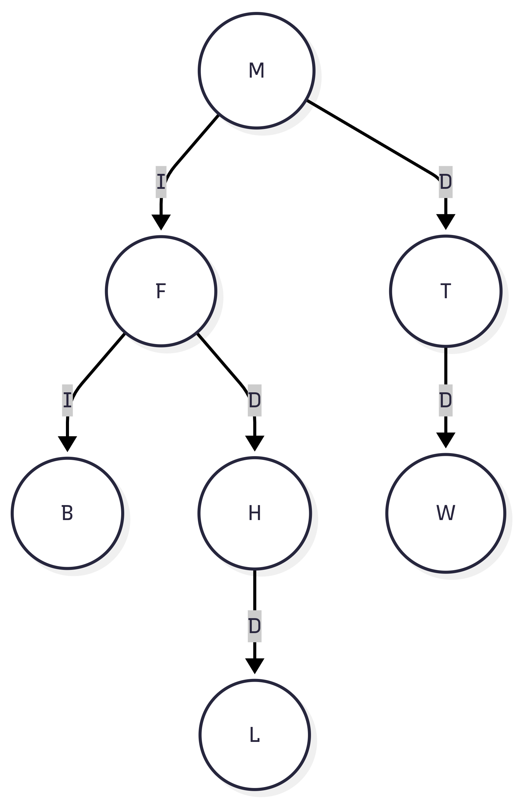

## Pila de Ejecucion y Resultado

* Revise la siguiente operación recursiva en un árbol binario e indique cual sería la pila de ejecución y el resultado para el árbol que se muestra en la imagen.

```python
def operacion(self):
    return self.__operacion(self.raiz)

def __operacion(self, nodo):
    if nodo is None:
        return 0
    
    resultado_izquierdo = self.__operacion(nodo.izquierdo)
    resultado_derecho = self.__operacion(nodo.derecho)
    
    return 1 + max(resultado_izquierdo, resultado_derecho)
```

```java
public int operacion() {
    return operacion(raiz);
}

private int operacion(Nodo<T> nodo) {
    if (nodo == null) {
        return 0;
    }
    
    int resultadoIzquierdo = operacion(nodo.izquierdo);
    int resultadoDerecho = operacion(nodo.derecho);
    
    return 1 + Math.max(resultadoIzquierdo, resultadoDerecho);
}
```



```bash
[M] -> 1 + max(altura([F]), altura([T]))
    [F] -> 1 + max(altura([B]), altura([H]))
        [B] -> 1 + max(altura([null]), altura([null])) = 1
        [H] -> 1 + max(altura([L]), altura([null])) = 1
            [L] -> 1 + max(altura([null]), altura([null])) = 1
    [T] -> 1 + max(altura([W]), altura([null]))
        [W] -> 1 + max(altura([null]), altura([null])) = 1
```
    
Entonces
    `[W] = 1`
Lo que hace que `[T] = 1 + max(1, 0) = 2`

Aqui ya tenemos el lado derecho

Ahora
    `[L] = 1`

Lo que hace que `[H] = 1 + max(1, 0) = 2`
y ademas `[B] = 1`

Lo que hace que `[F] = 1 + max([B], [H]) = 1 + max(1, 2) = 3`

Finalmente
    `[M] = 1 + max([F], [T]) = 1 + max(3, 2) = 4`

Por lo tanto, la altura del árbol es 4.

Puedes correr el `./ABB.java` en esta carpeta para ver la pila y resultado por ti mismo.