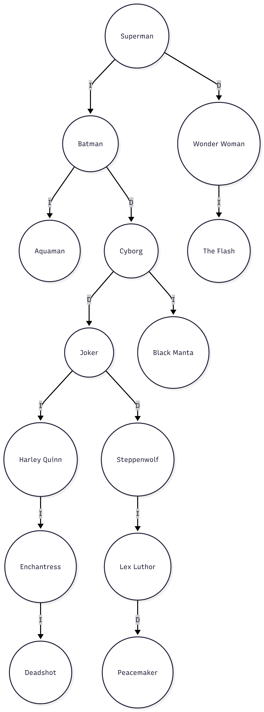
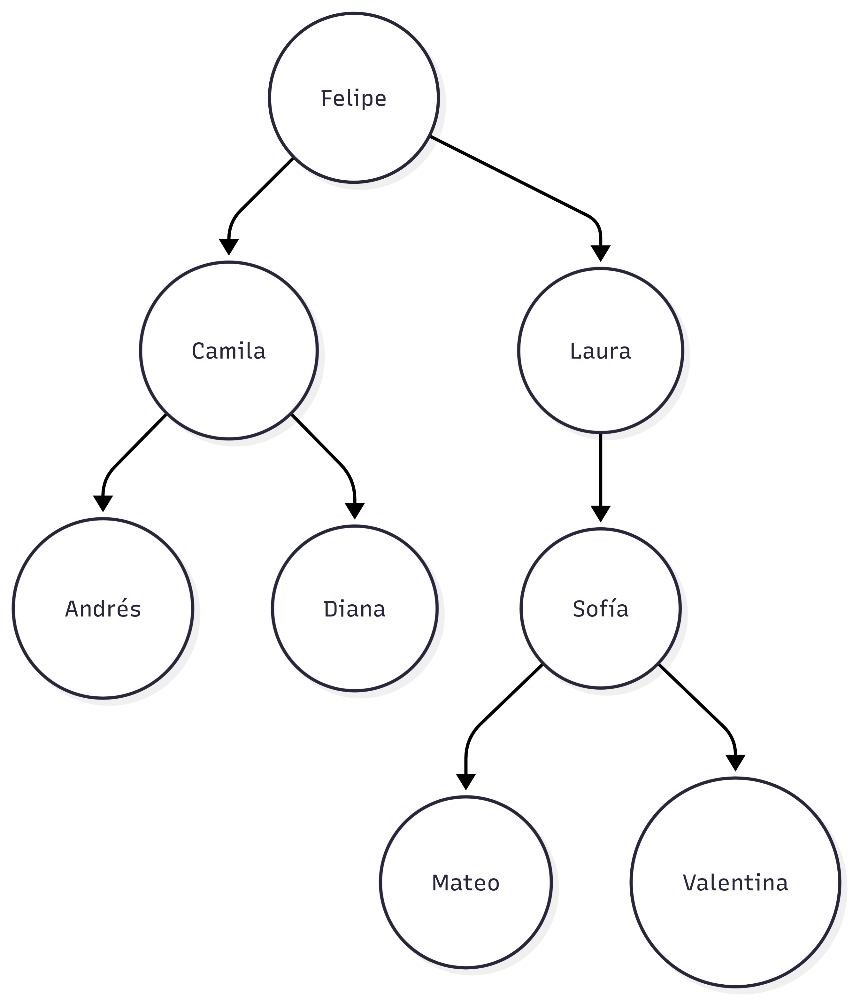

## Creación de un Árbol Binario de Búsqueda

* Dada la siguiente secuencia de valores indique el árbol binario de búsqueda resultante:

    `Superman, Batman, Wonder Woman, Aquaman, Cyborg, The Flash, Joker, Harley Quinn, Enchantress, Deadshot, Black Manta, Steppenwolf, Lex Luther, Peacemaker`

    

* Dada la siguiente secuencia de valores indique el árbol binario de búsqueda resultante:

    `Felipe, Camila, Andrés, Diana, Laura, Sofía, Mateo, Valentina`

    