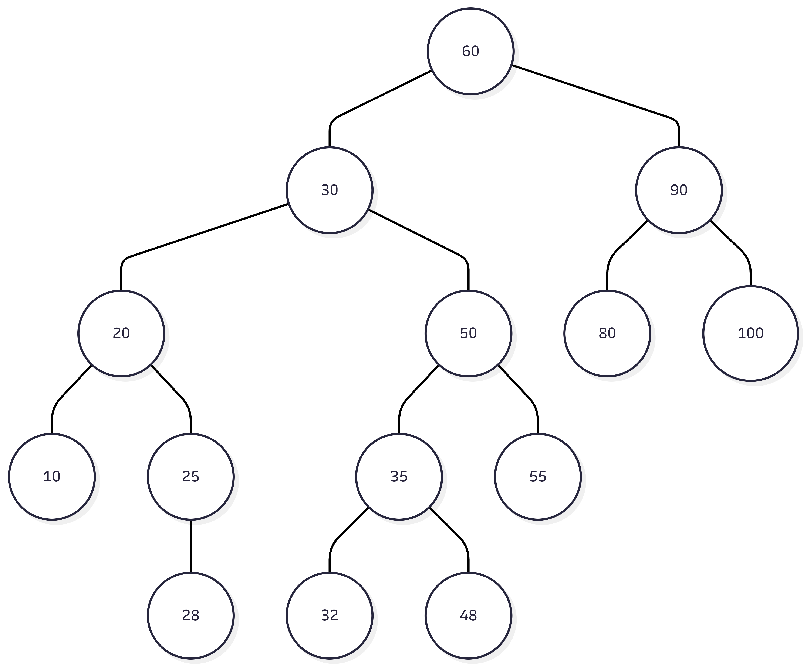
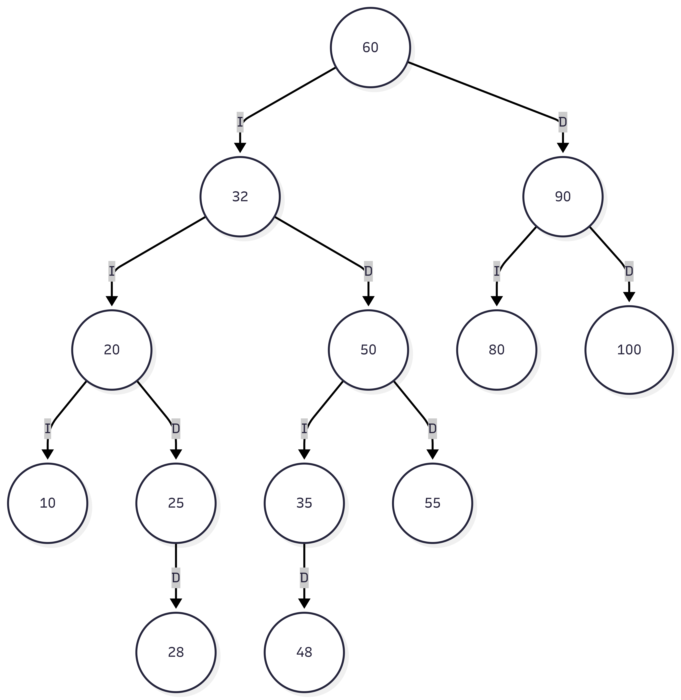
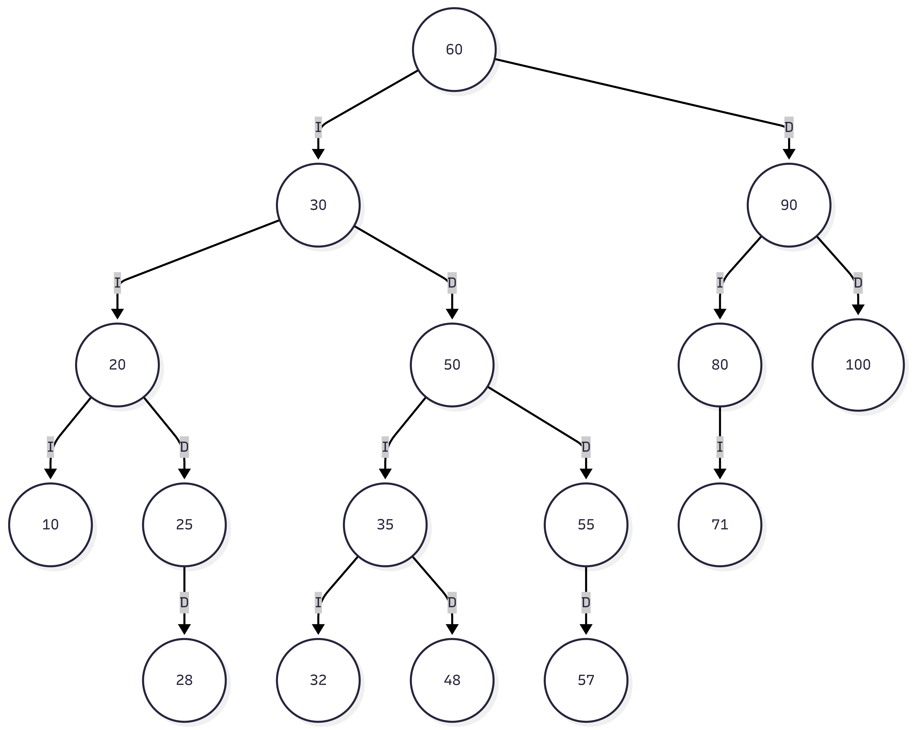
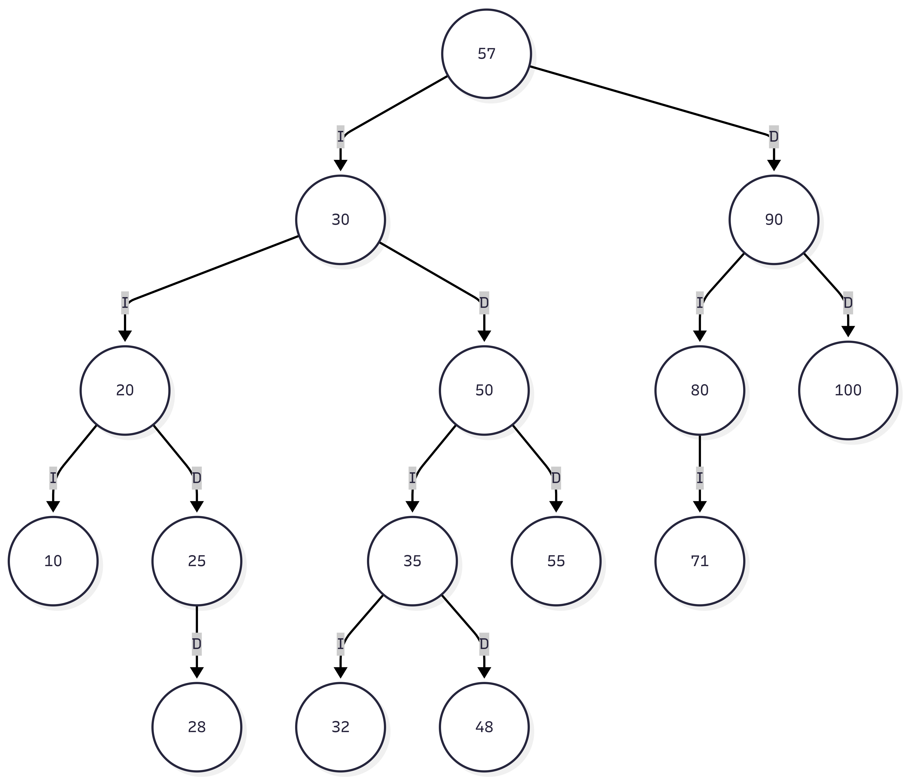

## Eliminación en un Árbol Binario de Búsqueda

*Sucesor: Reemplazar el nodo a eliminar por su sucesor, que es el nodo mas pequeño en el subárbol derecho del nodo a eliminar.*

*Predecesor: Reemplazar el nodo a eliminar por su predecesor, que es el nodo mas grande en el subárbol izquierdo del nodo a eliminar.*

* Dado el siguiente árbol indique el árbol resultante al eliminar el nodo con el valor (30) utilizando el algoritmo del sucesor in-orden.

## Resultado
    

*El nodo con valor 30 se eliminó y se reemplazó por su sucesor in-orden, que es el nodo con valor 32. El nodo 32 se movió a la posición del nodo eliminado, manteniendo la propiedad del árbol binario de búsqueda.*

* Dados los siguientes árboles iniciales y resultante indique cuál de los dos algoritmos se utilizó para la eliminación del nodo con valor (60).

#### Arbol Inicial

#### Arbol Después de eliminar el nodo con valor (60)

La respuesta correcta es la a.~ `Predecesor in-orden`.

*Para eliminar el nodo 60, se buscó el valor más grande de su subárbol izquierdo (el nodo que está más a la derecha bajando por el 30). En este caso, el valor máximo del subárbol izquierdo es 57. Al reemplazar el 60 por el 57, se cumple con la definición de predecesor in-orden.*